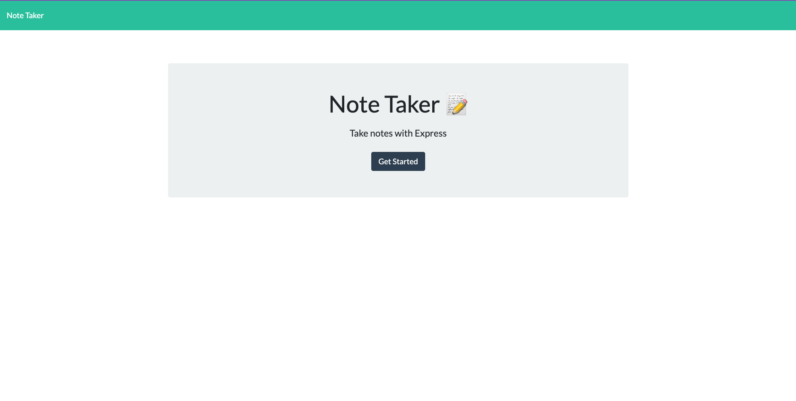
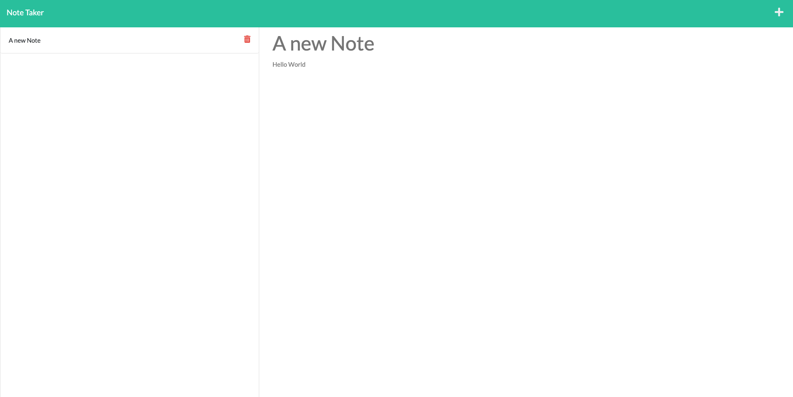

# Note Taker

## Task
To create a web app to add, delete and store notes.

## Outcomes
This project allowed me to learn more about the following;
- Javascript implimentation and use
- Express implimentation and use
- A deeper understanding of Javascript and it things you can do with it

## Installation

This project is deployed on Heroku and can be accessed through the following link: https://notetaker-olk.herokuapp.com/
This application can be used as a web application through the deployment link, or run locally by cloning the repo and running `node server.js`.

## Usage

This application is a note taking app, it can be used to create, store and delete short notes. Simply click get started and create short notes!

## Credits

This project was done in conjunction with the University of Sydney and Trilogy Education through their collaborated full stack bootcamp program.

---